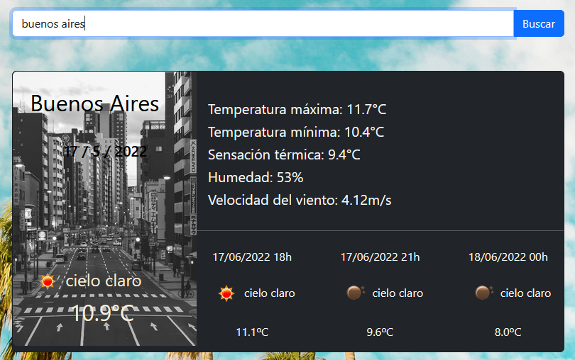

# Predicción Meteorológica
***
En esta App podremos ver los climas de las ciudades y los detalles correspondientes,tambien
se mostrara como seguira el clima en las próximas horas.

***
## Contenido

Para realizar este proyecto se utilizaron tecnologías como Javascript, React, NodeJS, HTML y CSS.
La API que se utilizó para obtener los datos es "openweathermap"
***
## Instalación

Clonar el repositorio en tu PC.

$ git clone https://example.com

$ cd ../path/to/the/file(directorio donde esta clonado el repositorio)

npm i para instalar las dependencias del proyecto.

npm start para correr el servidor.